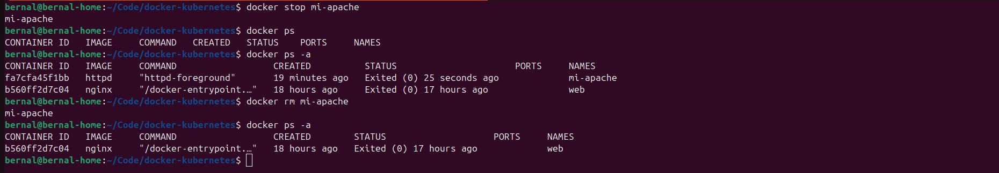

# Tarea 1 - Apache HTTP Server (httpd)

## Objetivo

Desplegar un servidor web Apache:

- Imagen: httpd
- Puerto: 8081
- Nombre del container: mi-apache
- Verificar accediendo a http://localhost:8081

## Desarrollo

### 1. Ejecutar el container

```bash
docker search httpd
docker run -d -p 8081:80 --name mi-apache httpd
```

**Explicación:** Se valido la disponibilidad de la imagen, seguidamente se creo y ejecuto un container con httpd en segundo plano (-d), mapeando el puerto 8081 al puerto 80 del contenedor (-p).

**Screenshot:**


### 2. Verificar que está corriendo

```bash
docker ps
docker logs -f mi-apache
curl localhost:8081
```

**Screenshot:**


**Explicación:** Se valido que existe una instancia corriendo asi tambien los logs generados por el contenedor en tiempo real (-f) y con curl se verifico que el servidor web este arriba.

### 3. Limpieza y eliminacion

```bash
docker stop mi-apache
docker ps
docker ps -a
docker rm mi-apache
docker ps -a
```
**Explicación:** Se detuvo el contenerdor (mi-apache) a continuacion se valido que no se tiene una instancia corriendo pero si una detenida (ps -a), seguidamente se elimino el contenedor y se valido.



## Conclusiones

Aprendi a iniciar una instacian de una imagen, validar que esta este funcionando, como detener y eliminar la instacia.
