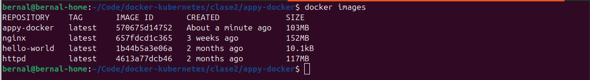
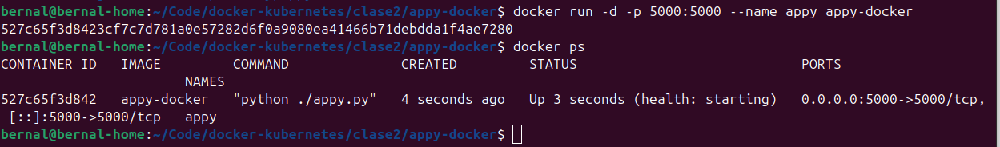
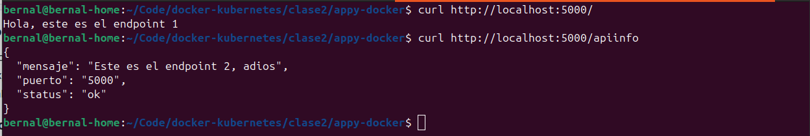
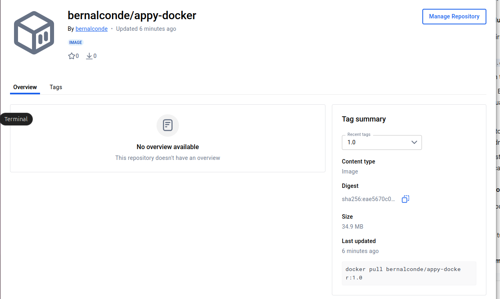

# Tarea 2 - Dockerización de Mi Aplicación

## Aplicación 'appy'

**Lenguaje:** Python

**Endpoints:**
- GET / - Página de bienvenida
- GET /apiinfo - Pagina de informacion

## Dockerfile

# Stage 1: Build
```bash
FROM python:3.10-slim AS builder
# Entorno virtual (venv)
RUN python -m venv /opt/venv
ENV PATH="/opt/venv/bin:$PATH"
#Copiar solo el archivo de requisitos
WORKDIR /app
COPY requirements.txt .
#Instalar dependencias en el venv
RUN pip install --no-cache-dir -r requirements.txt
```

# Stage 2: Production
```bash
FROM python:3.10-alpine AS production
#Labels metadata de la imagen
LABEL version="1.0"
LABEL description="Appy Produccion"
#Variable de entorno puerto
ENV PORT=5000
#curl (HEALTHCHECK)
RUN apk add --no-cache curl
#Cofiguracion usuario non-root 'appyus'
RUN addgroup -S appgroup && adduser -S appyus -G appgroup
WORKDIR /home/appyus/app
#Copiar aplicacion
COPY appy.py .
#Copiar el entorno virtual
COPY --from=builder /opt/venv /opt/venv
#Asignar propiedades
RUN chown -R appyus:appgroup /home/appyus/app /opt/venv
#Cambiar usuario
USER appyus
#Activar el venv para el usuario
ENV PATH="/opt/venv/bin:$PATH"
#Exponer el puerto para el host
EXPOSE $PORT
#HEALTHCHECK
HEALTHCHECK --interval=30s --timeout=3s --start-period=5s --retries=3 \
  CMD curl -f http://localhost:$PORT/api/info || exit 1
#Iniciar la aplicacion
CMD ["python", "./appy.py"]
```

**Explicación:**

| Stage | Propósito |
|-------|-----------|
| Build | Instalar todas las dependencias... |
| Production | Solo runtime... |

## Build

```bash
docker build -t appy-docker .
```

**Salida:**
```bash
[+] Building 13.4s (18/18) FINISHED                                                                         docker:default
 => [internal] load build definition from Dockerfile                                                                  0.0s
 => => transferring dockerfile: 1.21kB                                                                                0.0s
...
 => => naming to docker.io/library/appy-docker                                                                        0.0s
```

**Tamaño final:** 103MB

## Testing

Imagen de aplicacion:


Contenedor corriendo:


Verficacion de funcionamiento:


## Docker Hub

**URL:** https://hub.docker.com/r/bernalconde/appy-docker



## Optimizaciones

- Usuario non-root: appyus
- .dockerignore excluye variables de entorno, archivos de docker y git

## Conclusiones

Entre las dificultades encontradas fue la configuracion del puerto de la aplicacion, declarando este pero no inicializandolo. Tambien se tuvo problemas con la declaracion de las variables de entorno en el Dockerfile.

En esta clase aprendi a personalizar imagenes de docker asi como la configuracion base del Dockerfile, tambien se comprendio la importancia de las buenas practicas como el no utilizar el usuario root para correr los procesos de una imagen. A diferencia de la clase 1, en esta clase se tuvo que realizar un trabajo de configuracion y no solo implementacion. 
