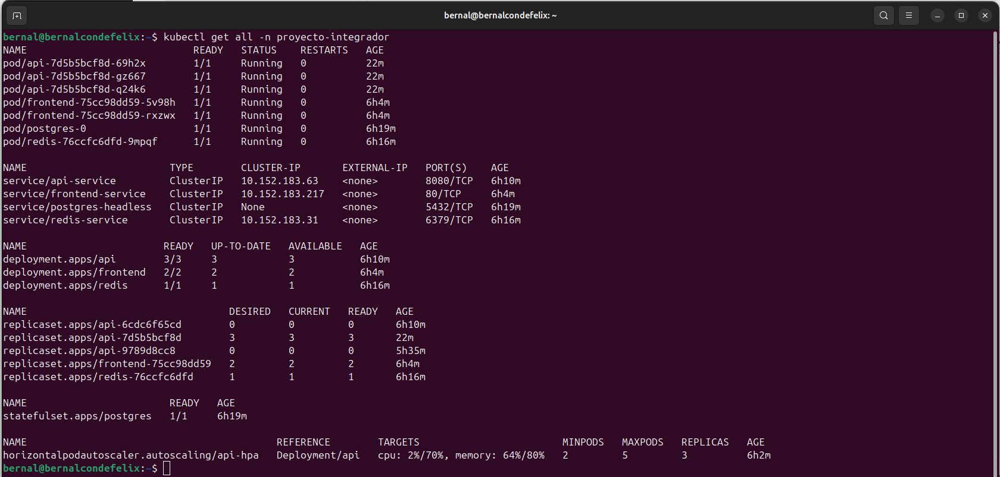
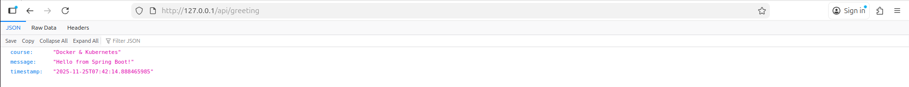

# Proyecto Final

## Parte 1: Setup del Ambiente

### microk8s instalado con addons habilitados

### Proyecto v2.0 funcionando en el cluster

### Ingress resolviendo el frontend

**frontend Angular**

**JSON con el saludo**

**lista de usuarios**

**"status"**

### Identidad del ambiente validada

