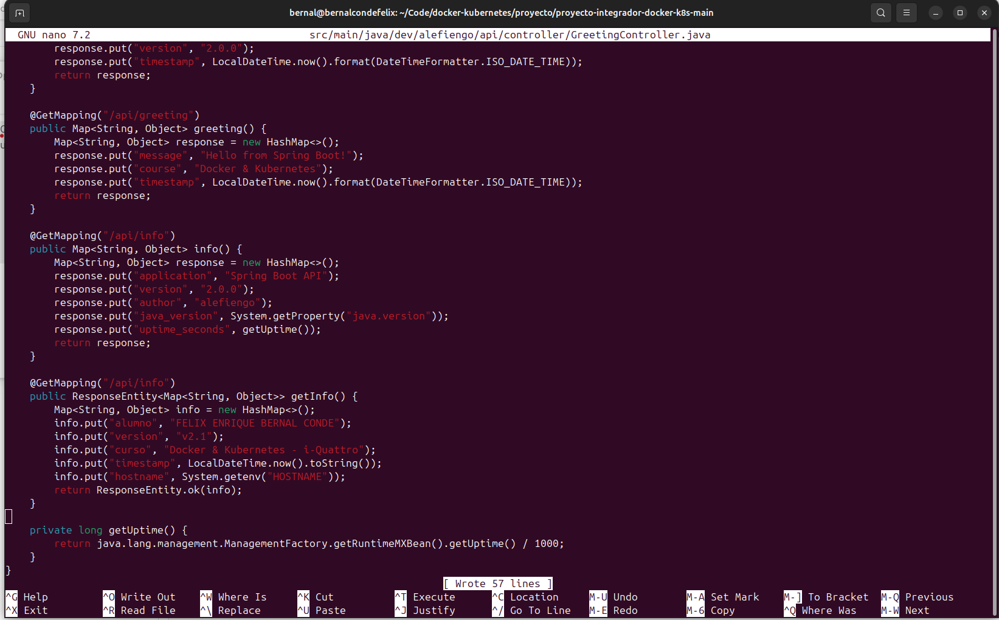

# Proyecto Final

## Parte 1: Setup del Ambiente

### microk8s instalado con addons habilitados

### Proyecto v2.0 funcionando en el cluster

### Ingress resolviendo el frontend

**frontend Angular**

**JSON con el saludo**

**lista de usuarios**

**"status"**

### Identidad del ambiente validada

## Parte 2: Iteración v2.1 - Modificar Backend

### Código del endpoint agregado

### docker images

### Link a imagen en Docker Hub
https://hub.docker.com/repository/docker/bernalconde/springboot-api/tags

### kubectl rollout status durante la actualización

**Nota:** Se presento un error durante el rollout debido a una mala configuracion en la adicion de un nuevo endpoint, se adiciono el nuevo endpoint a la misma ruta. Una vez corregido el error se procedio a repetir el ciclo de construcion y despliegue.

### kubectl get pods

### output de curl http://192.168.1.240/api/info

