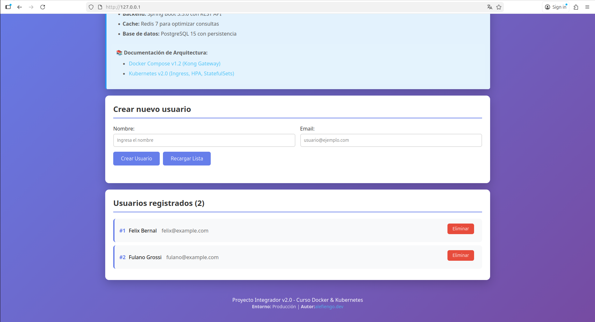
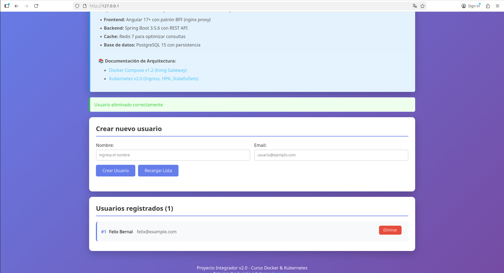
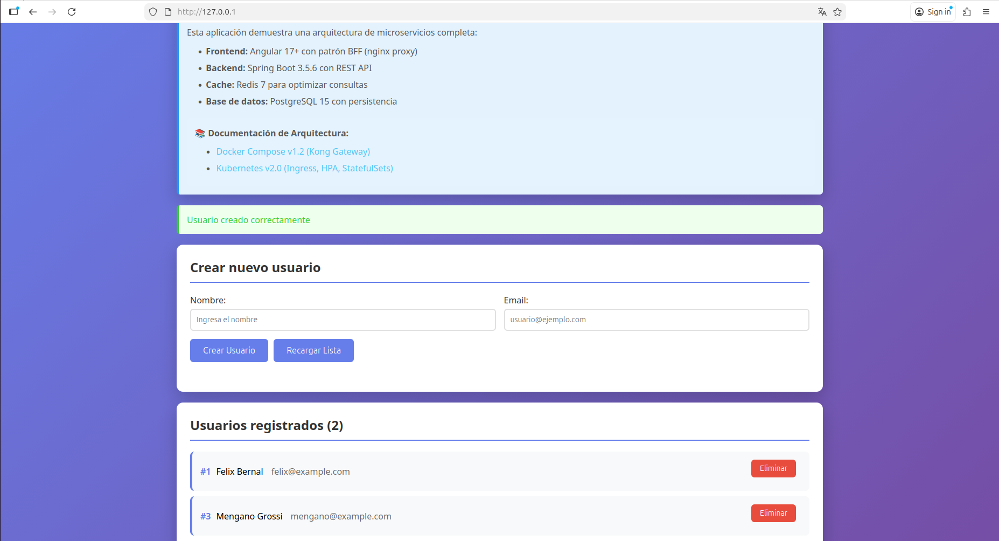

# Proyecto Final

## Parte 1: Setup del Ambiente

### microk8s instalado con addons habilitados

### Proyecto v2.0 funcionando en el cluster

**Nota:** No se puedo obtener la ip externa a pesar de que se configuro un rango de ips no utilizados (en un primer intento 192.168.1.240-250 y 192.168.1.200-210 en un segundo intento), se adjunta en la captura las validaciones correspondientes a la habilitacion del MetalLB 

### Ingress resolviendo el frontend

**frontend Angular**

**JSON con el saludo**

**lista de usuarios**

**"status"**

### Identidad del ambiente validada

